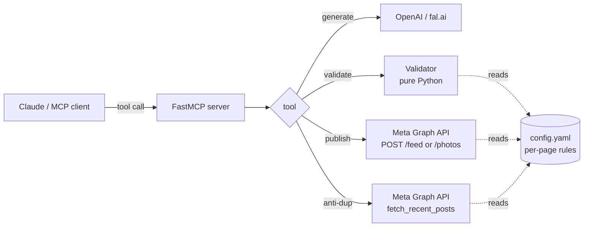

# mcp-fb-publisher

> An [MCP](https://modelcontextprotocol.io) server that lets Claude (or any MCP-compatible LLM) safely publish posts to **multiple Facebook Pages** through the Meta Graph API, with built-in guardrails: brand-voice config, banned-topic blocklists, image-required enforcement, and anti-duplication checks across recent feed posts.

[](https://github.com/anthonyjbolo/mcp-fb-publisher/actions/workflows/ci.yml)
[](https://opensource.org/licenses/MIT)
[](https://www.python.org/downloads/)
[](https://claude.com/claude-code)

## Why this exists

Letting an LLM agent post directly to your Facebook Pages is a footgun unless you put guardrails in front. Common failure modes I have hit running 5+ pages:

1. **Token expired silently** — post fails at midnight, nobody notices for 3 days.
2. **Same angle posted twice in 14 days** — audience tunes out, reach drops.
3. **Text-only post** when the brand voice mandates an image — engagement craters.
4. **Banned topic leaked** — competitor name, internal codename, or deprecated product mentioned.

`mcp-fb-publisher` ships an MCP server that wraps the Meta Graph API behind 4 deterministic tools, all driven by a single `config.yaml`. Every publish call goes through validation by default. Validation is pure-Python (no LLM), reproducible in CI, and runs offline.

## What it does

4 MCP tools:

| Tool | What it does |
|------|--------------|
| `fb_publish_post` | Publishes (or schedules) a post on a configured page. Runs full validation by default; pass `skip_validation=True` to bypass. |
| `fb_validate_pre_publish` | Dry-run all guardrails. Returns `verdict: go|block` plus per-check details. Network-optional. |
| `fb_anti_duplicate_check` | Compares a candidate message against the page's recent posts using Jaccard similarity over word 4-grams. |
| `fb_generate_post_with_image` | Generates an image via OpenAI (`gpt-image-1`) or fal.ai (`flux-pro`) and returns a URL ready for `fb_publish_post`. |

## 5-minute quickstart

```bash
# 1. Install
pip install mcp-fb-publisher

# 2. Copy and edit the example config
cp config.example.yaml config.yaml
# -> set page_id values, brand voices, banned_topics

# 3. Set required env
export META_USER_TOKEN="<your long-lived Meta page/user token>"
export MCP_FB_PUBLISHER_CONFIG="$PWD/config.yaml"

# 4. (Optional) for image generation
export OPENAI_API_KEY="sk-..."        # or
export FAL_KEY="..."

# 5. Run the MCP server (stdio transport)
mcp-fb-publisher
```

### Wire it into Claude Desktop / Claude Code

Add to your `claude_desktop_config.json`:

```json
{
  "mcpServers": {
    "fb-publisher": {
      "command": "mcp-fb-publisher",
      "env": {
        "META_USER_TOKEN": "your_token_here",
        "MCP_FB_PUBLISHER_CONFIG": "/absolute/path/to/config.yaml",
        "OPENAI_API_KEY": "sk-..."
      }
    }
  }
}
```

Then ask Claude things like:

> *"Post on the marketing page: 'New collection drops Friday'. Generate an image first, validate, then publish."*

Claude will call `fb_generate_post_with_image` → `fb_validate_pre_publish` → `fb_publish_post`.

## Architecture



The split between **generation**, **validation** and **publish** is intentional: it lets the LLM iterate on the visual without burning Meta API quota, and it makes the guardrails inspectable in CI without a Meta account.

## Anti-duplication strategy

We compare the candidate message against every post within `anti_duplicate_lookback_days` (per-page, default 14) using **Jaccard similarity over word 4-grams**:

1. Normalize: lowercase, strip accents (NFKD), drop URLs, drop punctuation, collapse whitespace.
2. Build the set of word-level 4-grams for both texts.
3. `similarity = |A ∩ B| / |A ∪ B|`
4. If `similarity >= similarity_threshold` (default 0.5), block.

Why this and not embeddings: deterministic, free, no extra API key, fast enough for 50 candidates per call. If you want LLM-grade semantic comparison, add another layer on top — the `fb_validate_pre_publish` tool returns the score so your agent can decide.

## Brand voice config

```yaml
defaults:
  language: en
  brand_voice: |
    Direct, professional, no fluff.
  banned_topics: []
  image_required: true
  anti_duplicate_lookback_days: 14

pages:
  marketing_main:
    page_id: "0000000000000000"
    name: "My Brand — Main"
    brand_voice: |
      Confident, concise, customer-first.
    banned_topics:
      - competitor_brand_a
      - leaked_codename
    image_required: true

  community:
    page_id: "0000000000000002"
    name: "Community"
    image_required: false
```

Note: the `brand_voice` field is informational — it's surfaced to the calling LLM via the tool description but the server itself does not LLM-validate against it. This is by design (tests must run offline). Layer your own LLM check on top if you want enforcement.

## Use cases

### 1. Multi-page agency

You manage 5 Facebook pages for clients. Each has its own brand voice, banned topics (competitor names), and image policy. Configure them all in one `config.yaml`, give Claude the tool, and let the agent draft + validate + publish across all of them with safety rails.

### 2. Solo founder

You run a single product page and want Claude to schedule the next 30 days of posts. Set `image_required: true`, give the agent your product brief, and use `fb_anti_duplicate_check` to make sure no two posts land on the same angle within a fortnight.

### 3. E-commerce

You rotate flash promos. Set `anti_duplicate_lookback_days: 7` for the promo page and `14` for the evergreen content page. Combine with `scheduled_at` to queue a week's worth of posts in one shot.

## Development

```bash
git clone https://github.com/anthonyjbolo/mcp-fb-publisher.git
cd mcp-fb-publisher

python3.12 -m venv .venv
source .venv/bin/activate
pip install -e ".[dev,openai,fal]"

# Run the test suite (offline, no Meta credentials needed)
pytest

# Lint
ruff check .
```

All tests use `httpx.MockTransport` and `pytest-mock`. **No real Meta API calls in tests.**

## Security

- The Meta token is read from `META_USER_TOKEN` only. Never hard-code it.
- Token strings are redacted from error messages (`***REDACTED***`) before they leave the process.
- The validator is sync and offline — safe to run in CI without exposing credentials.
- `config.yaml` is in `.gitignore`. Only `config.example.yaml` is committed.

## Roadmap

- [ ] Instagram Graph API support (the validator already works, only the meta_client publish path needs adapting).
- [ ] Optional ntfy webhook on publish failure.
- [ ] LLM-grade brand-voice scoring as an opt-in tool.
- [ ] Token rotation helper (`fb_check_token_expiry`).

## En français — pourquoi ce projet

Construit en Nouvelle-Calédonie pour gérer 5 pages FB en parallèle (auto-école, marketplace de bingo, atelier d'apps, marque de tee-shirts, page média). Tous les écueils ci-dessus sont des bugs que j'ai vraiment vécus. Le serveur MCP est la couche que j'aurais aimé avoir le premier jour — maintenant elle est libre.

## License

MIT — see [LICENSE](LICENSE).

## Contributing

Issues + PRs welcome. Please run `pytest` and `ruff check .` before opening a PR. For substantial features, open an issue first to discuss.

#BuiltOnClaudeCode
