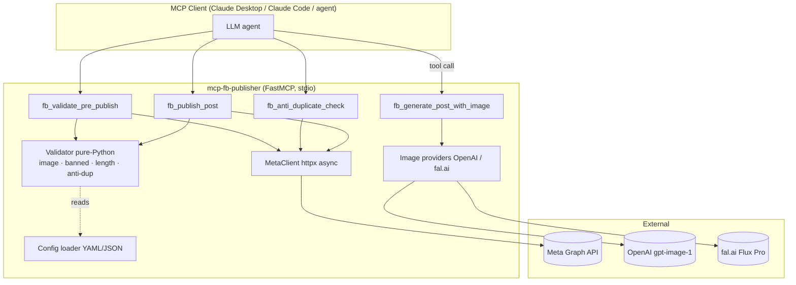
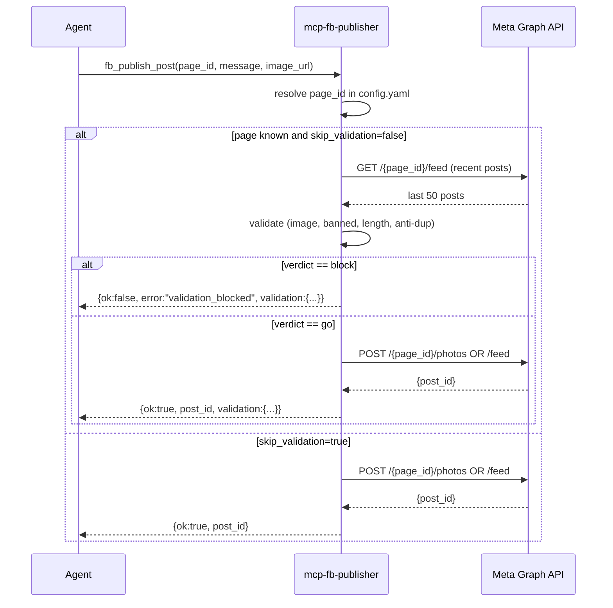

# Architecture

## Overview



## Decision flow inside `fb_publish_post`



## Layers

### Validator (pure functions)

All checks are sync, deterministic, no API key required. This is the contract:

| Check | Input | Output |
|-------|-------|--------|
| `image_required` | `(message, image_url, page)` | block if config requires image and `image_url` is empty |
| `banned_topics` | `(message, page)` | block if any banned substring matches (accent-insensitive, lowercase) |
| `length` | `(message)` | block if `< 10` or `> 63206` chars (Meta's hard limit) |
| `anti_duplicate` | `(message, recent_posts, lookback_days, threshold)` | block if any post within window has Jaccard ≥ threshold |

The `anti_duplicate` check uses **word-level 4-grams** with **Jaccard similarity**:

```
similarity = |A ∩ B| / |A ∪ B|
```

Default threshold = `0.5`. We picked Jaccard over embeddings for three reasons:

1. **Deterministic** — same input → same score, easy to assert in tests.
2. **Free** — no extra API call, no extra key, no quota.
3. **Fast** — 50 candidate comparisons in <5ms.

If you want LLM-grade semantic comparison, layer it on top via your own tool — `fb_anti_duplicate_check` returns the score plus the closest post ID so you can chain.

### MetaClient

Async wrapper around `httpx.AsyncClient`. Three endpoints used:

1. `GET /debug_token` — token health, expiry, scopes
2. `GET /{page_id}/feed?fields=id,message,created_time` — fetch recent posts
3. `POST /{page_id}/feed` or `POST /{page_id}/photos` — publish

Critical security rule: **the token never appears in error messages**. Any 4xx/5xx response is redacted (`***REDACTED***`) before being returned to the caller. There's a dedicated test for this (`test_publish_post_redacts_token_in_error`).

### Config

Loaded from (in order):

1. Explicit path argument
2. `MCP_FB_PUBLISHER_CONFIG` env (file path)
3. `MCP_FB_PUBLISHER_CONFIG_JSON` env (raw JSON, useful for serverless)
4. `./config.yaml` in cwd
5. Empty default (no pages registered)

Defaults are merged into each page entry. `banned_topics` and `white_keywords` are union'd (defaults + page).

### Image providers

Two backends:

| Provider | Model | Pricing (Mar 2026) | When to use |
|----------|-------|--------------------|-------------|
| OpenAI | `gpt-image-1` | ~$0.08/image | Need text-on-image (logos, labels) — best legibility |
| fal.ai | `fal-ai/flux-pro/v1.1` | ~$0.031/image | Pure visual, photorealistic or stylized — cheapest path |

Both return a public URL that Meta Graph API can fetch directly via `/<page_id>/photos?url=...&caption=...`. No intermediate upload step needed.

## Why this design

1. **Server stays offline-testable**: 52 tests run with zero network and zero credentials. Coverage 84%.
2. **LLM hooks where it adds value (image generation, brand-voice drafting), guardrails where determinism matters (validation)**.
3. **Single config file** = one place to audit before letting an agent loose on your pages.
4. **Token redaction by default**: even if an upstream prints the error, the secret never leaks.
